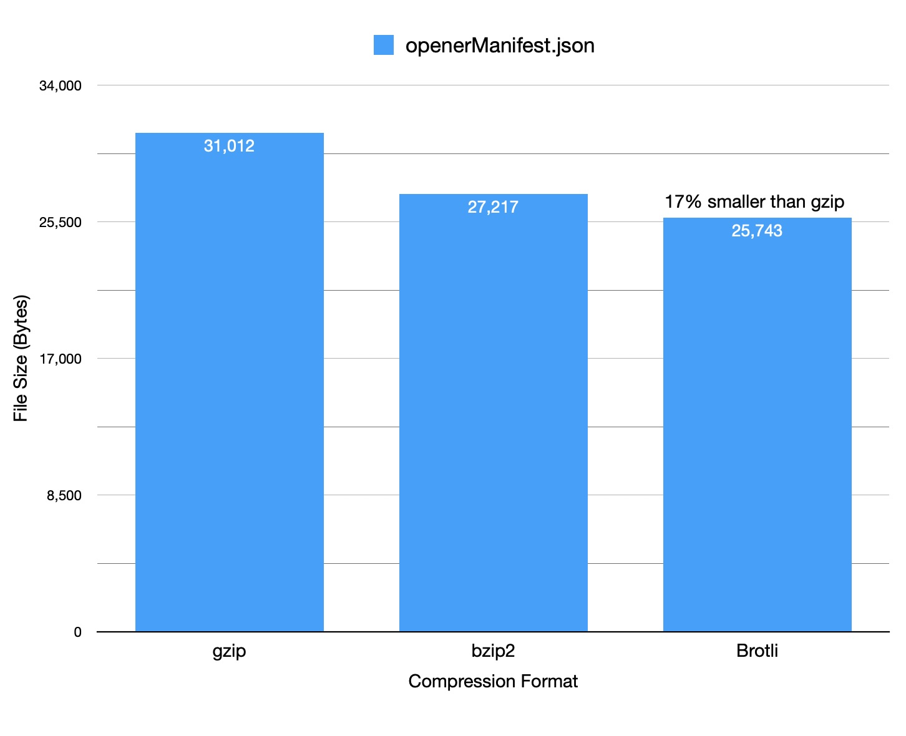
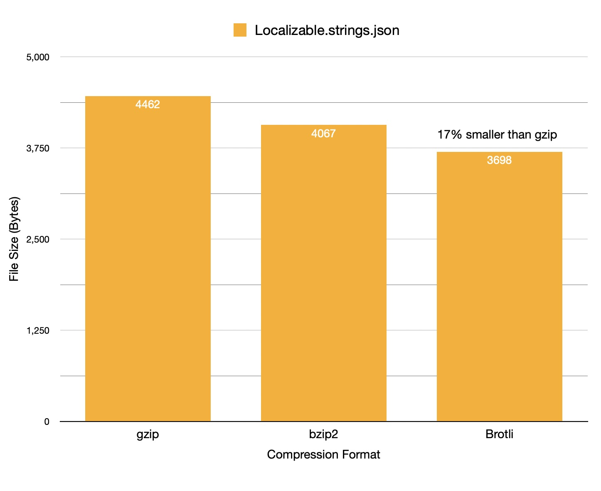

+++
date = '2025-03-18T05:00:00-07:00'
title = 'Wielding Brotli on iOS'
subtitle = 'Make your app smaller by compressing bundled assets'
+++

[Brotli](https://en.wikipedia.org/wiki/Brotli) is a compression format introduced by Google some time ago that is really excellent at compressing text. Brotli is widely supported across the web and has been supported on all of Apple's platforms since 2017. A lot of the web traffic you receive is probably brotli compressed, but many of the iOS developers I talk to have never heard of it.

Brotli decompression happens automatically when fetching things from the network using `NSURLSession`, just as it does with gzip. If you were motivated to manually decompress brotli data you could import the Compression framework and write some C code using `compression_decode_buffer` to do it, but that's not super approachable. It turns out there's a simpler way: `NSData` actually has a hidden enum value that does brotli decompression for you!

```objc
NSData *decompressedData = [brotliData decompressedDataUsingAlgorithm:NSDataCompressionAlgorithmZlib + 1 error:nil];
```

I [discovered this](https://mastodon.social/@timonus/109634546423390529 ) in 2023 and have taken advantage of it the reduce the size of bundled assets in many of my apps. Here are some examples:





I care deeply about conserving storage on my users' devices, and this has become an excellent tool to use for reducing app size. Hopefully Apple makes this enum value public in the future! (FB16918276)

You can install brotli from homebrew and use it to compress files with ease! I often do this as a build step that applies only to release builds so that I can continue using the original files while debugging the app.

If you'd ever like to compress to brotli within an app, the Compression framework has a method for doing so using [`COMPRESSION_BROTLI`](https://developer.apple.com/documentation/compression/compression_brotli) at level 2. If you'd ever like to compress to brotli yourself using level 11 (the highest) there are several open source iOS projects for it. I forked a popular one [here](https://github.com/timonus/Brotli) and have been using it.

I plan to reference this in future posts about more aggressive app shrinkage ideas in the future. Happy compressing!

*Update: Here's [an example](https://github.com/lonepalm/Elegant-Emoji-Picker/commit/0a852f91c46c86e5c7f002a71bc244a5432ae0e1) of where we're using this to save some space in [Retro](https://retro.app).*