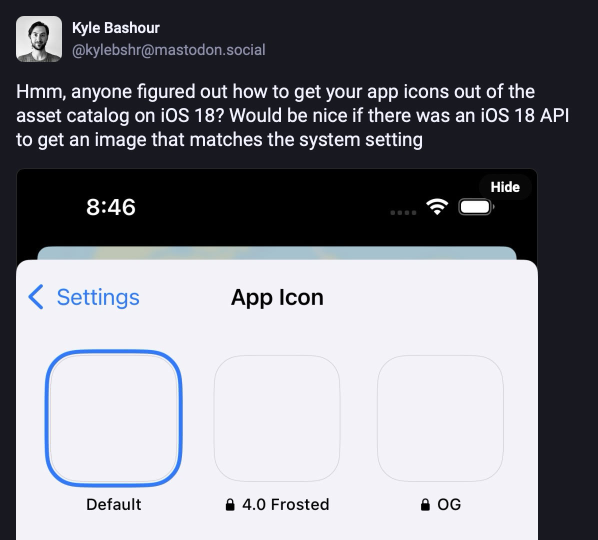
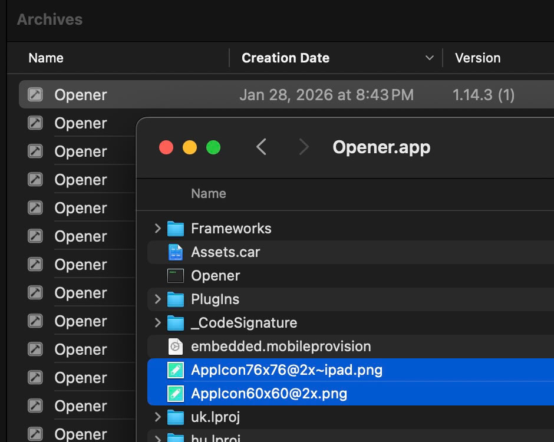
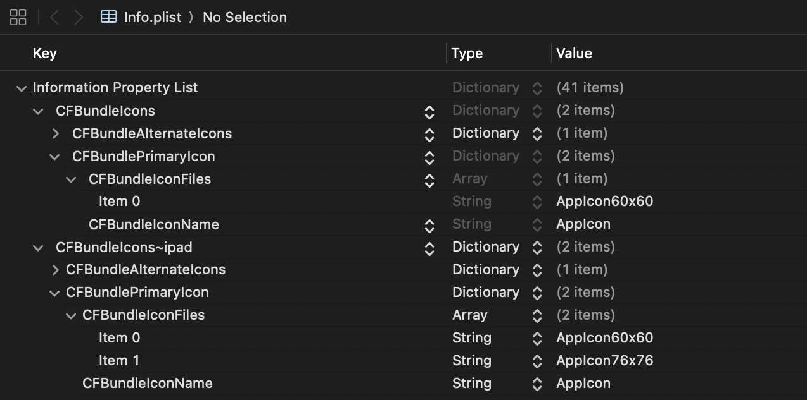
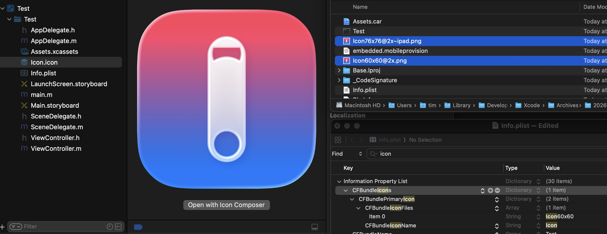

+++
date = '2026-01-30T19:00:00-08:00'
title = 'Iconic loading'
Subtitle = 'Showing your app’s own icon in 2026'
+++

Showing your app's icon _in_ your app: seems like something you might want to do right?

Prior to iOS 18‘s introduction of home screen dark mode it was very easy to get your app's icon, just use `+imageNamed:`. But in iOS 18 and higher to show your app's icon you might need to package a separate copy or fetch it from a server just for this purpose.



Well, it turns out that there is a place where iOS stashes a copy of your app's icon that is accessible without these gymnastics. Xcode's build process has created a separate copy of app icons for years that are embedded as files in your bundle.



These files are placed here presumably to be loaded by the system outside of springboard.

You can find the names of these files by looking at particular keys in your bundle's `infoDictionary`.



From there you can enumerate the available files and pick the largest one to show. This is how I'm doing it.

```objc
@implementation NSBundle (AppIcon)

- (UIImage *)appIcon
{
    NSDictionary *const bundleIcons = self.infoDictionary[@"CFBundleIcons"];
    NSArray<NSString *> *const imageNames = bundleIcons[@"CFBundlePrimaryIcon"][@"CFBundleIconFiles"];
    UIImage *appIconImage = nil;
    CGFloat maxWidth = 0.0;
    
    for (NSString *const imageName in imageNames) {
        UIImage *const image = [UIImage imageNamed:imageName inBundle:self compatibleWithTraitCollection:nil];
        if (image.size.width > maxWidth) {
            appIconImage = image;
            maxWidth = image.size.width;
        }
    }
    return appIconImage;
}

@end
```

This even works with iOS 26's new `.icon` file format!



I've been using this trick in [Opener](https://apps.apple.com/app/id989565871) for ages, and we're now using it in [Retro](https://apps.apple.com/app/id6443709020)! It could be a good way to slim down your app a tiny bit.

*Note: This only applies to your app's _default_ icon, if you provide alternate icons you'll still need another way to show them.*

Credit to [this Stack Overflow answer](https://stackoverflow.com/a/23158902/3943258) where I originally got this idea from ages ago.