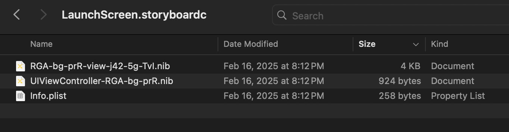
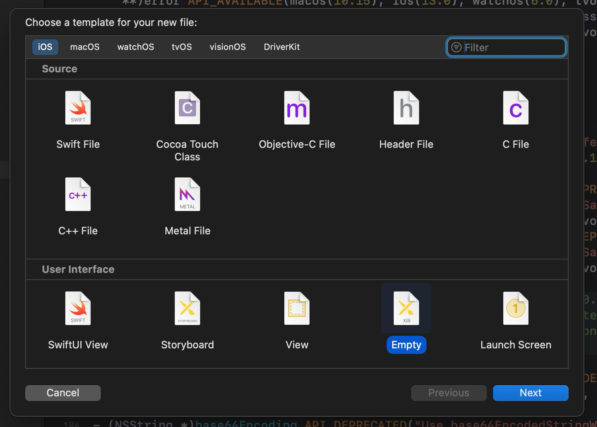
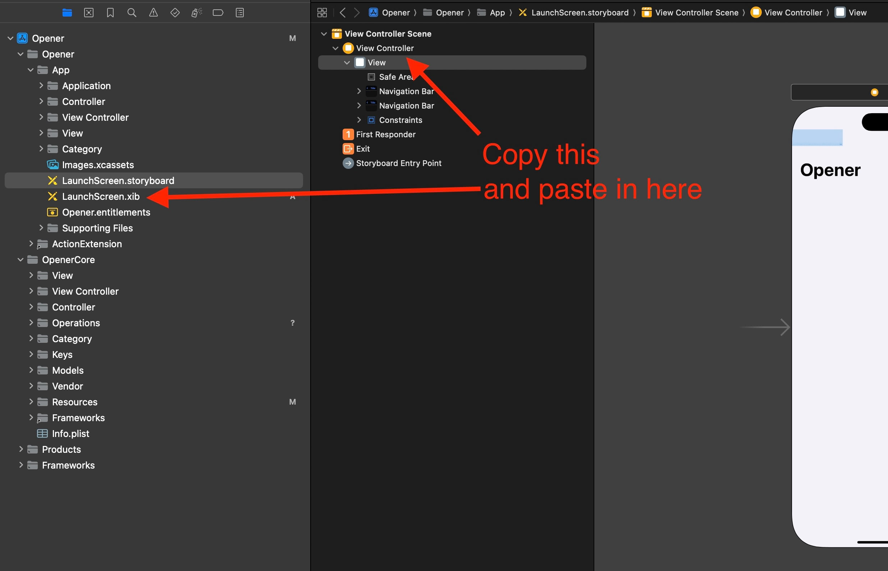
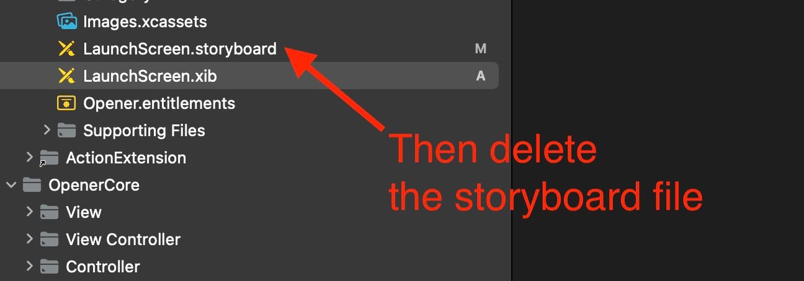
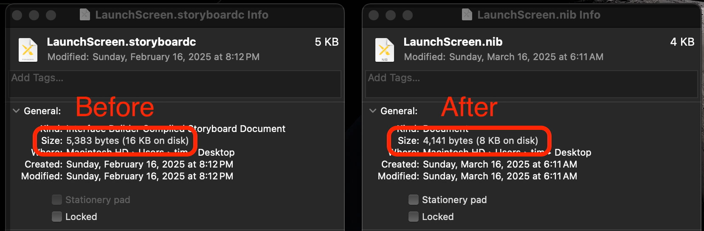

+++
date = '2025-03-21T06:00:00-07:00'
title = 'The case for launch xibs'
subtitle = 'They’re smaller than storyboards'
+++

I'm obsessed with keeping apps small, and I recently found an unlikely place to save a couple KB: launch screens. The default on iOS for a while has been to create a launch storyboard for your app, but launch storyboards are bundles that wrap a few files.

Many launch storyboards don't use any functionality that isn't also available in the simpler, older xib format. I copied and pasted the launch screens from within the .storyboard into a freshly made .xib and the results saved 1.2 KB.

It's just a couple KB, but in apps that are <2 MB like [Opener](https://apps.apple.com/app/id989565871) every KB counts!

You could save even more space by using the relatively new [`UILaunchScreen` info.plist key](https://sarunw.com/posts/launch-screen-using-plist/), but that lacks some of the customizability of launch storyboards/xibs.

*Side note: Opener has two launch screens, one for iPhone and one for iPad, so this savings is doubled*