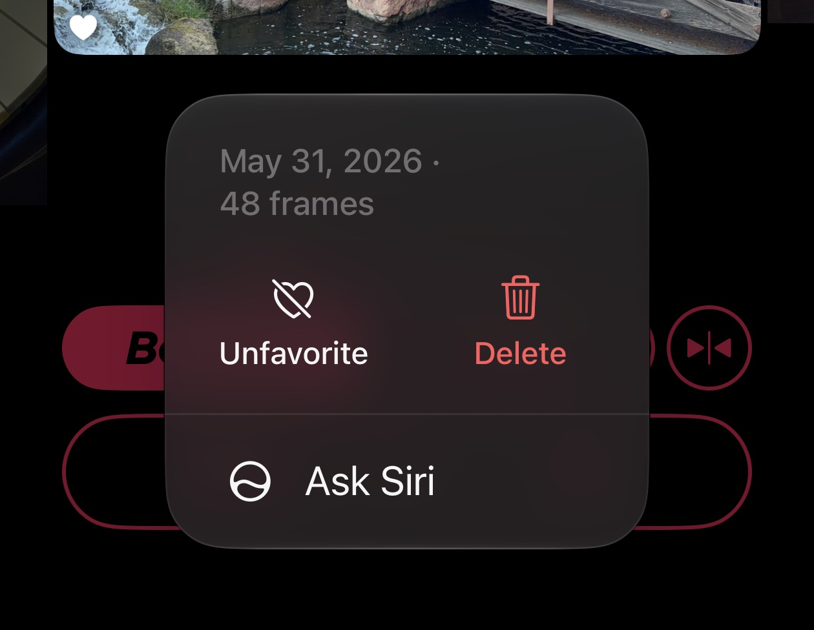
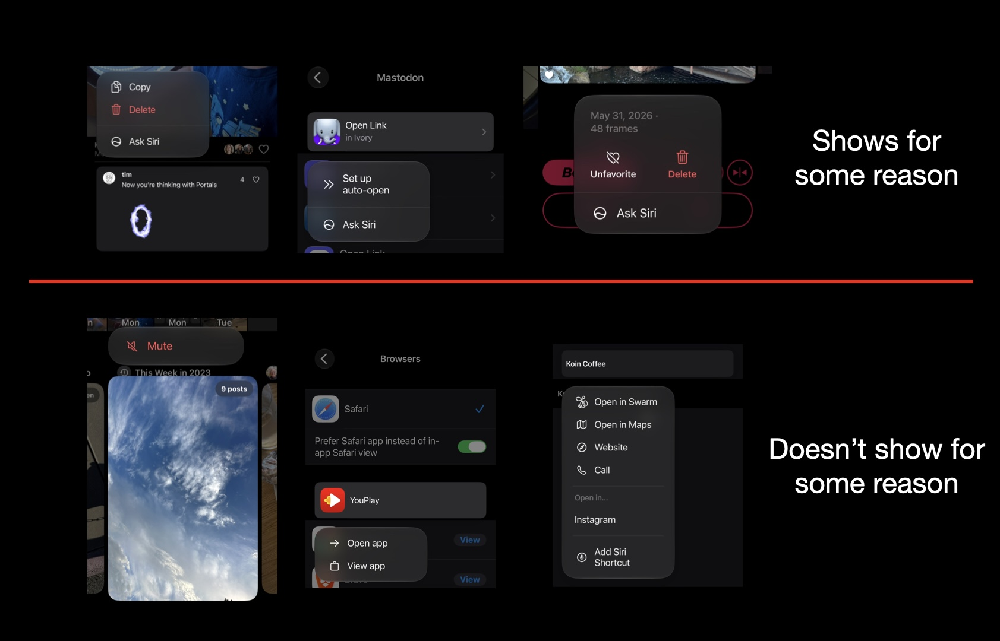
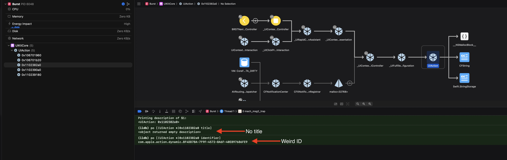
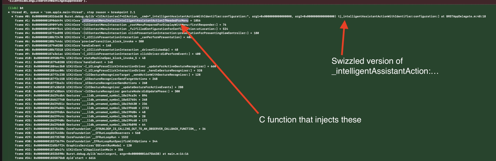
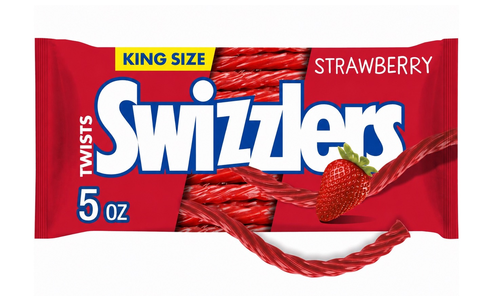

+++
date = '2026-08-13T8:00:00-08:00'
title = 'Ask not what Siri can do for you'
+++

iOS 27 introduces Siri AI, and Apple's really excited about it. So excited that your app can get new "Ask Siri" options in `UIMenu`s with no apparent opt out.

It seems like the OS is using some heuristics for choosing when to show this and when not to. I see it in some places in my apps, and not in others.

Kind of odd that there's not an official way to opt out of these, so I did some digging to find if there's some way to omit them.

I discovered that these `UIAction`s are a bit odd, they lack a title and have a transient identifier.

However, they are all created using the `+_intelligentAssistantActionWithIdentifier:configuration:` class method on `UIAction`.

The injection of these happens via a C function *after* you've been queried for your menu items, so the best way I've found thus far to omit them is by swizzling `+_intelligentAssistantActionWithIdentifier:configuration:` to return `nil` or to hide it using `UIMenuElementAttributesHidden`.

Of course swizzling private methods should be done cautiously, but if you feel inclined this is a way to omit those "Ask Siri" entries!