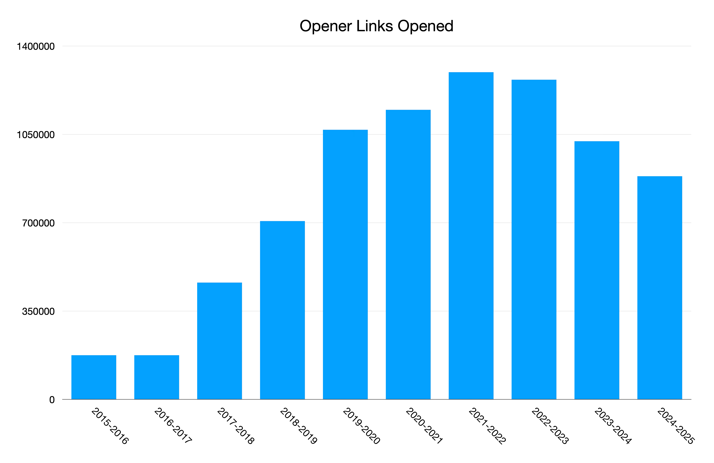
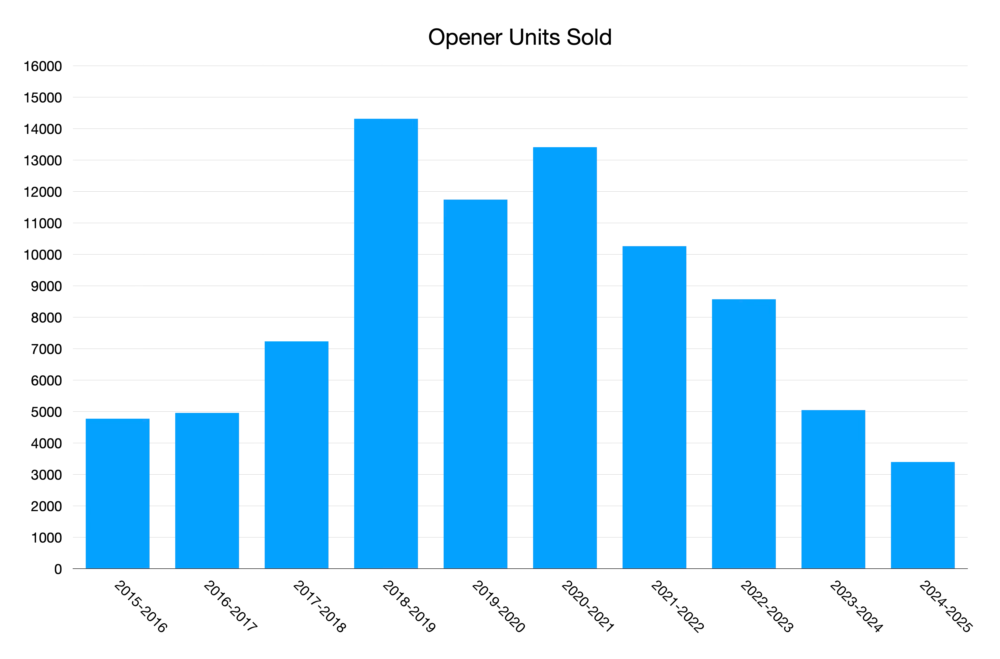
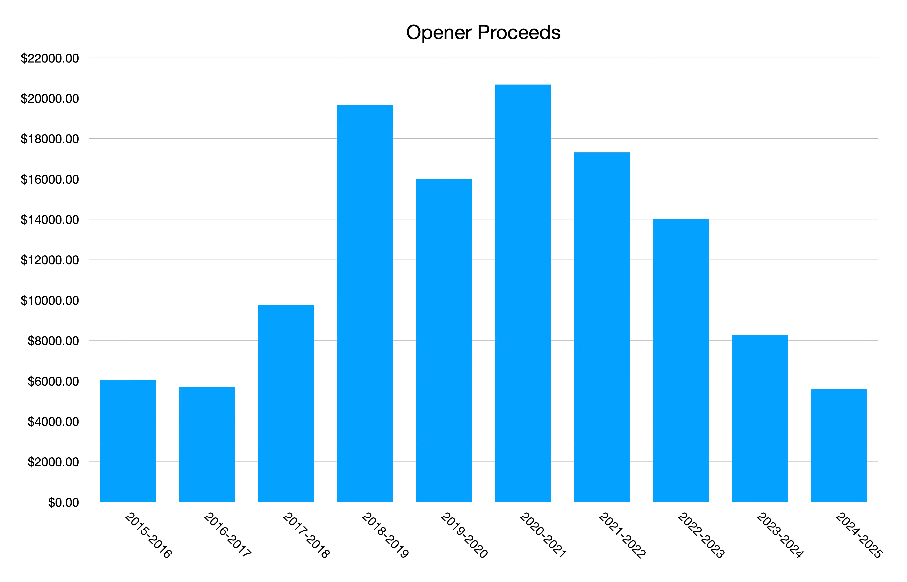
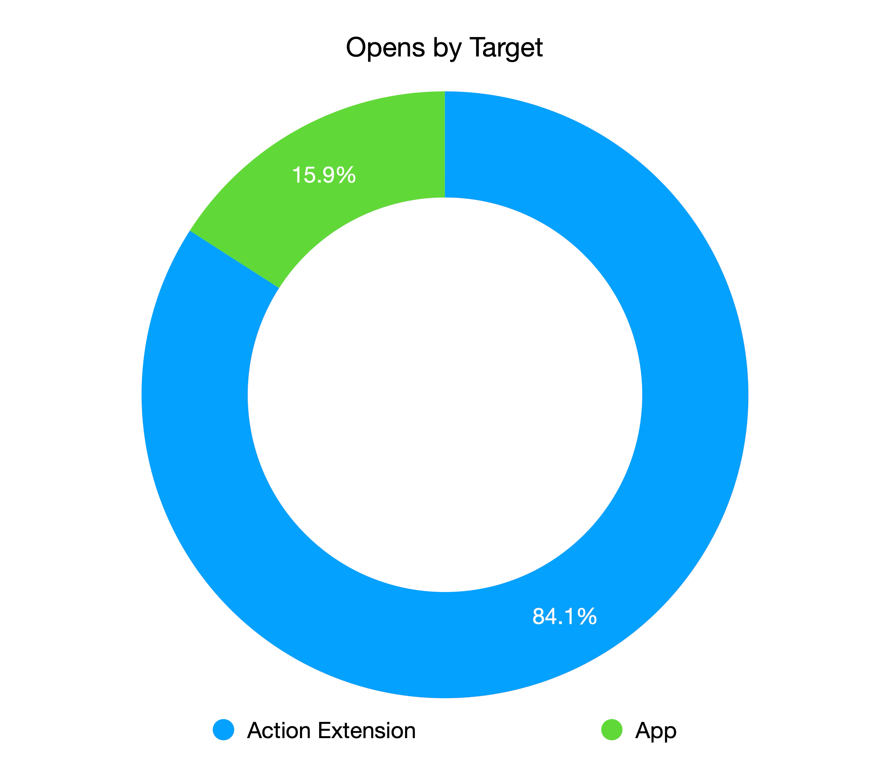

+++
date = '2025-06-01T13:40:00-07:00'
title = 'Your Links, Your Way — Ten Years of Opener'
+++

Today [Opener](https://apps.apple.com/app/id989565871) turns 10 years old. It's safe to say Opener is the side project that I'm most proud of, and has had the most success on the App Store. I wanted to take some time to reflect on the past 10 years building it. This blog post won't be too technical, it's mostly a collection of little stories and thoughts.

## History

### Early Inspiration

The idea for Opener came about from a few things:
- In my work at [Flipboard](https://flipboard.com) at the time we were spending a lot of time building out rendering for various different content types. I remember we'd just added support for [SoundCloud](http://soundcloud.com/) and we were talking about the possibility of building the SoundCloud waveform in our app and I thought: "This isn't the best use of our time as a news app. We should really allow people to view this detail *in SoundCloud* if they want."
- I attended an event at Twitter HQ where they discussed Twitter Cards and how you could include metadata in them so Twitter could open links in your app. I remember thinking it would be cool if that worked everywhere, not just in Twitter.
- There was an iOS Workflow (pre-Apple acquisition) / bookmarklet that was floating around that allowed people to open Tweets in Tweetbot and other apps. I remember feeling like I wished this worked for _every_ link and _every_ app.
- My friend Jordan Kay tweeted about a Mac app he was working on that would open URLs in native apps named [Lattice](https://github.com/jordanekay/Lattice). (Coincidentally Opener now works great on Macs with Apple Silicon!)

The introduction of [app extensions](https://www.theverge.com/2014/6/2/5773080/ios-8-apps-can-talk-to-each-other) in iOS 8 was the catalyst that made it impossible for me to not build Opener. I saw app extensions as the _perfect_ vessel for this functionality, allowing in-context actions to be taken on links.

### Elevator Pitch

The elevator pitch for Opener is as true today as it was in 2015, so I'll say it again.

> People love the apps on their phones, and companies spend millions of dollars developing those apps, yet when you tap links from those companies instead of opening the app it launches a logged out, slow, subpar web experience. What if you could open links directly in apps where you get the best possible experience? That's what Opener does.

### Stories

- I remember the week I started Opener. I was in my parents house in Broomfield, Colorado  for Easter week when I got the first prototype working. [This](early-screenshot.jpg) is the earliest screenshot of it I can find.
- I learned a _crapload_ about regular expressions while building Opener since it requires a lot of them. Turns out this is a really useful skill to have, and I've used it a bunch of times in my career since.
- I clearly remember the day Opener launched, June 1, 2015. It was a Monday and I had my summer intern starting that day, so I wasn't really thinking about it. I used [Buffer](https://buffer.com) to pre-schedule all the [posts](https://medium.com/p/497136c3e09c) about the launch, but towards the end of the day a few people I worked with were like "hey, whoa, you launched this today? This is cool." Over the week a few blogs wrote about it, which made me really happy. At the end of the week our CTO Eric Feng gave me a high five for being ["crunched"](https://techcrunch.com/2015/06/03/opener-for-ios-lets-you-open-web-links-in-your-apps-instead/).
- WWDC 2015 was the week after Opener launched. I was _terrified_ when Apple announced universal links in iOS 9, which could effectively replace Opener. As it turned out over time, universal links only really work for first-party apps, and they don't work that well in general anyway. Opener still serves people very well when they want control over opening links, or when universal links bug out as they're prone to.
- I designed the [original icon](opener-icon-og.jpeg) in code as a `UIView`, but it wasn't exactly beautiful. Fortunately I started dating somebody in 2016 (now my wife) who was much better at design than me and she agreed to give the icon [an overhaul](https://medium.com/@timonus/opener-14-610343db047b#d67e). The icon she designed is still the one that app uses today!
	- *Side note*: I had _hundreds_ of [stickers](sticker.JPG) of the original icon printed and I've given away maybe 50 total. If you live and the US and you want one shoot me [a DM](https://mastodon.social/@timonus) and I'll mail it to you.
- In iOS 14 Apple limited the number of URL schemes you could include in `LSApplicationQueriesSchemes` to 50. I was nervous that people might be frustrated that Opener could no longer detect which apps were installed since it supported over 200 apps, so I continued to link Opener with the iOS 14 SDK for almost a whole year. I had a dedicated Mac mini that I kept on the old OS so I could continue to use the old Xcode to build it. Finally, when I looked, it turned out that 95% of links opened in Opener are within its top 50 most popular apps. I released the update that limited the list to 50 and I've gotten nearly zero complaints about it since.
- The week in 2022 when I was in the hospital after my first child was born I was alerted to the fact that [somebody had cloned Opener](https://www.reddit.com/r/apple/comments/y577fi/comment/ismkis2/). I was in an emotional state already, and this made me _pissed_. Up until this time I'd left Opener's rule set as open source for people who wanted to contribute, but when reading the source for this clone's JS I saw it clearly just copied the whole thing. I rapidly made Opener's rule set private and hardened up security about how the app loads it. Since then a few more clones have popped up, but it seems like they've mostly become stale and forgotten.
- I sent the source code for Opener [to the moon](https://www.reddit.com/r/space/comments/l52iym/you_can_send_something_to_the_moon_for_free_im/) thanks to a kind person on Reddit! Sadly, it didn't make it and burned up returning to Earth in January 2024. Still cool though.
- I applied for and [got to attend](https://retro.app/m/5J4LF67) Apple‘s developer labs for the Vision Pro on the Vision Pro’s launch day to test out Opener! While I was there the cranky engineer running the lab told me that Apple wasn’t going to add an API for detecting if an iPad app is running on Vision Pro. Afterwards I [figured out how to detect this anyways](https://medium.com/p/08a85db0fb31) and it still seems to be [how people do it](https://developer.apple.com/forums/thread/733029?answerId=786093022#786093022) these days. A few months after the Vision Pro launch I bought and returned one within the two week window to fix a bug one of my users was only encountering on Vision Pro. 

## Stats and Factoids

The stat I care most about for Opener is how many links are being opened in it. While I don’t have a 100% accurate picture of this number over the last 10 years, I’ve been able to patch together a pretty good approximation.

Here are the total copies of Opener sold over the past 10 years.

Here’s the proceeds I’ve made from Opener in this time.

A vast majority of the links opened go through the action extension instead of the app itself. I still hold that app extensions are my favorite feature ever added to iOS because of this.

# The Future

Opener is feature rich, stable, and capable of meeting my users’ needs. I’m very cautious about not [enshittifying](https://en.wikipedia.org/wiki/Enshittification) it by tacking on unneeded features, and when I do add new features they’re appropriately buried under the app’s core functionality. I plan to be the best platform citizen I can, and to take advantage of new platform features that make sense for Opener as best as I possibly can. I also plan to continue to add support for opening more and more apps over time. This app is a labor of love, and I plan to keep it a well oiled machine for as long as I’m around.

Here’s to the next 10 years!

