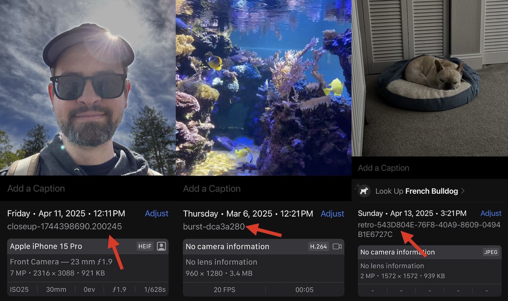

+++
date = '2025-04-18T05:00:00-07:00'
title = 'Storing custom metadata in PHAssets'
+++

`PHPhotoLibrary` is a powerful resource that lets you interact with one of iOS' most vital components as a developer. We're lucky to have it compared with a lot of other OS features that provide little or no developer access.

In the past I've wanted to add small bits of custom information to `PHAsset`s, however `PHAsset` doesn't provide a way to do this. As a workaround you could add custom Exif or video metadata to the asset at write time, then load the asset, extract that data, and parse it at read time, but that could be relatively slow since fetching `PHAsset` resource data can be iCloud-backed. Additionally, if downscaled data is returned from `PHAsset`, that metadata could be stripped. I wanted a quick way to stash a small amount of information in `PHAsset`s.

What I found is `PHAssetResource`. `PHAssetResource` can be used when writing `PHAsset`s to add fine-grained file representations of assets, but there's a field within it that can be used to add arbitrary strings: the `originalFilename`. You can set the original filename to whatever you'd like like so

```objc
PHAssetCreationRequest *creationRequest = [PHAssetCreationRequest creationRequestForAsset];
PHAssetResourceCreationOptions *options = [PHAssetResourceCreationOptions new];
options.originalFilename = /*Filename of your choice, including custom info*/;
[creationRequest addResourceWithType:... data:... options:options];
```

*Note: I recommend using the correct file extension for whatever type your using when setting `originalFilename` as mismatches can lead the Photos framework to fail.*

And you can get the original filename from a `PHAsset` _without_ loading the entire data from the asset.

```objc
for (PHAssetResource *const resource in [PHAssetResource assetResourcesForAsset:asset]) {
    NSString *originalFilename = resource.originalFilename;
    // Use originalFilename
}
```

`PHAssetResource` seems to be a part of `PHAsset`'s metadata, so it doesn't require an additional load of the full underlying data to retrieve. It's quick.

Here's how I'm leveraging this:
- [Close-up](https://apps.apple.com/app/id515789135) includes IDs in filenames when writing to `PHPhotoLibrary` so that I can later tell if the photo has already been written and skip re-writing it in certain cases.
- [Burst](https://apps.apple.com/app/id1355171732) includes a hash of the params used to create media in filenames so that I can reuse assets previously saved to the photo library instead of generating new ones.
- [Retro](https://retro.app) includes photo IDs in filenames so we can count photos that are uploaded then saved to the local device as "already uploaded" instead of as new assets.



If you're looking to store a bit of extra info in `PHAsset`s this could be a great way to do it!