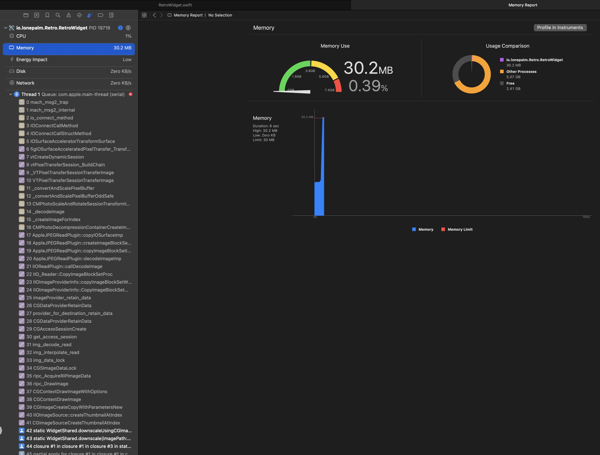
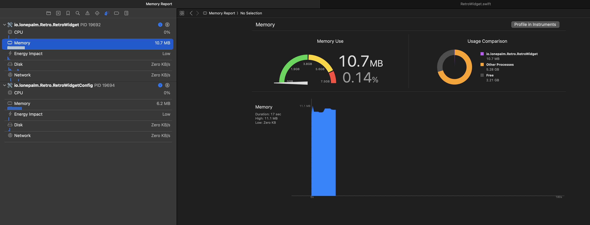

+++
date = '2025-08-08T05:00:00-10:00'
title = 'Ultra memory-friendly thumbnails on iOS'
Subtitle = 'Avoid blowing through the memory budget, even in extensions'
+++

This week [Retro](https://retro.app) has [a fresh new look](https://x.com/ryanolsonk/status/1953114758720127454) to the Friends widget. Where we used to only show a single post, we now show a grid of recent posts from your friends.

It’s not super well documented, but widgets have size restrictions on the images you can add to timeline entries. This combined with the very low memory limits imposed on iOS extensions (~30MB) has historically made loading images into widgets a bit of a headache. We got crashes while downscaling very often, even when using the efficient `CGImageSource` thumbnailing methods.

So, how do we go from showing one image per widget to showing a whole grid without blowing up the memory limit?

In the past I’ve heard of the [QuickLook framework’s thumbnailing methods](https://developer.apple.com/documentation/quicklookthumbnailing?language=objc) being designed explicitly for the low memory requirements of extensions, but nothing I’d worked on had warranted using them. To enable Retro’s grid widget I decided to give them another shot.

Per the docs ([here](https://developer.apple.com/documentation/quicklookthumbnailing/qlthumbnailgenerator/savebestrepresentation(for:to:contenttype:completion:)?language=objc#:~:text=Use%20this%20method%20to%20create%20and%20save%20the%20thumbnail%20image%20outside%20of%20your%20process%20as%20it%20doesn’t%20impose%20the%20same%20constraints%20on%20memory%20usage.) and [here](https://developer.apple.com/documentation/quicklookthumbnailing/qlthumbnailgenerator/savebestrepresentation(for:to:as:completion:)?language=objc#:~:text=This%20is%20primarily%20intended%20for%20file%20provider%20extensions%20which%20need%20to%20upload%20thumbnails%20and%20have%20a%20small%20memory%20limit.)), in order to get out-of-process thumbnailing you have to use the [`-saveBestRepresentationForRequest:toFileAtURL:...`](https://developer.apple.com/documentation/quicklookthumbnailing/qlthumbnailgenerator/savebestrepresentation(for:to:as:completion:)?language=objc) method that operates on files. You give it a file, and it hands you a thumbnail file back. I wasn’t expecting this API to work given that I hadn’t heard much about it before, but to my surprise it does exactly what it claims! The widget, even when processing many images, now barely consumes memory where it used to have a nonzero chance of running out.

If you’re working in a memory constrained environment like widgets or extensions on iOS I highly recommend checking this out.

## July 2026 Update

[Paul Haddad](https://tapbots.social/@paul) reached out to me about using this API. Apparently there's an undocumented upper limit on the size of thumbnails you can request from QuickLook of around 3.5 MP. If you request a thumbnail that's too large you'll get something an error `QLThumbnailErrorDomain` with code `0` and underlying error code `102`. 3.5 MP is plenty for a widget, but might not work for other cases, something to bear in mind!