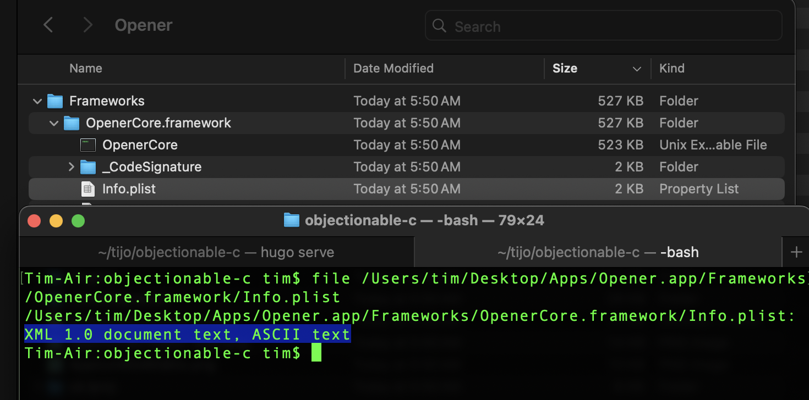
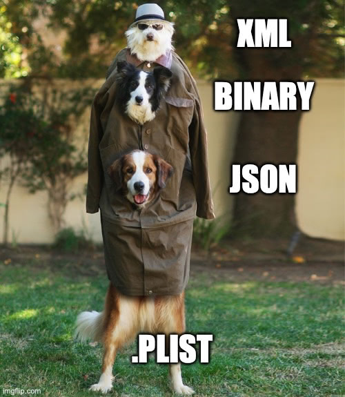
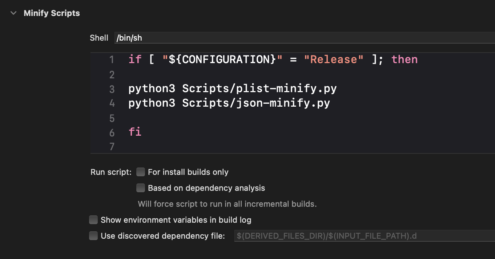

+++
date = '2025-07-25T05:00:00-10:00'
title = 'Trim the Fat: Static file tricks to slim down your app'
+++

I care deeply about keeping apps as small as possible. It’s our responsibility as iOS developers to preserve resources on our user’s devices.

I’ve detailed some strategies about [compressing files](/posts/brotli-ios/) and [compressing particular file formats](/posts/woff2-ios/) that you can use to reduce your app’s size, but what about files you can’t compress or change the format of? For example: third party libraries often bundle in plists and JSON, and you couldn’t compress those files without forking the library and changing how they’re loaded. Some libraries are closed source so you couldn’t even do this if you wanted to.

Well, it turns out there’s a little slack you can get from these files. 

## Plists

Plists have several different encodings under the hood: XML, binary, and JSON. Of these, binary often is the most compact and quickest to load, but sometimes the bulkier formats are bundled into your built app instead.





When loading plists the particular encoding doesn’t matter, so we can safely re-encode plists as binary as a build step to save on space. Furthermore, many other formats like `.xcprivacy` and `.strings` are actually plists under the hood, and we can re-encode those too.


## JSON

The size of JSON files can be easily reduced by stripping out whitespace.

```
// These are equivalent
{
    "foo": [
        "bar",
        "baz"
    ],
    "xyz": 123
}

{"foo":["bar","baz"],"xyz":123}
```

For large JSON files this whitespace can be significant. For example: in [Opener’s](https://opener.link/get) rule set JSON whitespace accounts for 45% of the original file size. We can safely strip out this whitespace as a build step to reduce JSON file size while preserving the original data. Just like plists, there are other formats like `.ahap` that are just JSON under the hood that we can also tidy up.

## Putting it together

Using these strategies I’ve made a couple of scripts you can use to reduce your app’s size, available [here](https://github.com/timonus/appscripts). You can add them to your app using a build script step like the following.



```
if [ "${CONFIGURATION}" = "Release" ]; then

python3 Scripts/plist-minify.py
python3 Scripts/json-minify.py

fi
```

I only run these for release builds since they slow down the build slightly.

## Examples

I use these scripts in all the apps I work on. In [Retro](https://retro.app) they’re currently saving ~400 KB, not too bad for a build step that requires little maintenance!

What’s fun about these scripts is, since they run on fully built apps, you can run them on any app. Here are some other examples for apps I don’t have the source for.

- In Cash app they save 333 KB
- In Instagram they save 924 KB
- In eufy they save 1.2 MB
- In Xcode 16.4 they save 40 MB

If you’re looking for some low hanging fruit to reduce your app’s size I recommend trying these out!