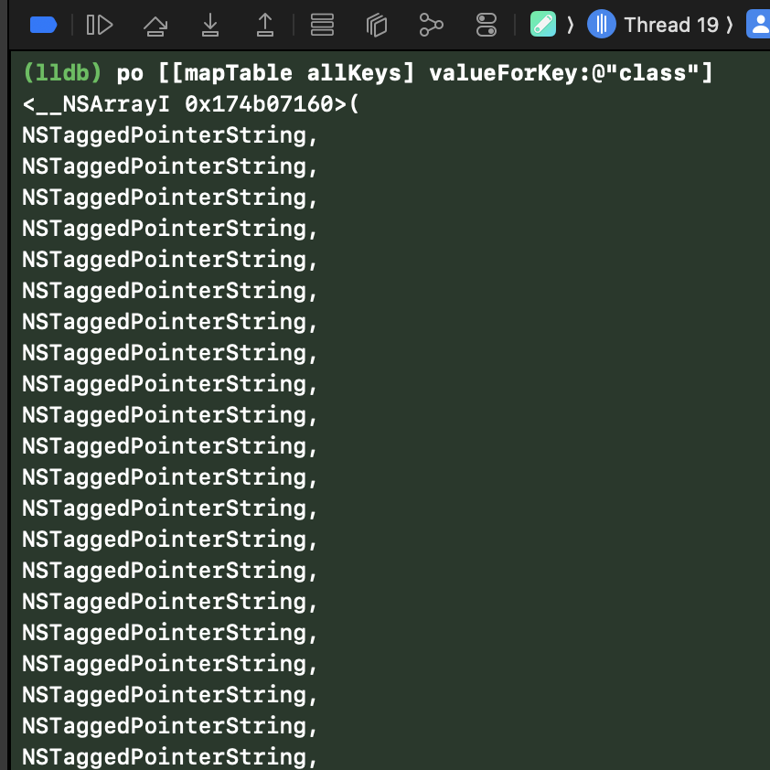

+++
date = '2025-03-31T05:00:00-07:00'
title = 'Tagged pointer string keys'
+++

[This blog post](https://mikeash.com/pyblog/friday-qa-2015-07-31-tagged-pointer-strings.html) by Mike Ash about how tagged pointer strings work in Objective-C is fantastic, one of my favorites. It details under what circumstances `NSString`s become tagged pointers instead of full objects. Tagged pointers have [performance  and space efficiency benefits](https://www.mikeash.com/pyblog/friday-qa-2012-07-27-lets-build-tagged-pointers.html#:~:text=Tagged%20Pointer%20Uses,uses%20as%20well.) over full objects by bypassing heap allocations.

After reading this a few years ago I was inspired to find a "nail" for the proverbial "hammer" it discusses: I wanted to find places where I could leverage tagged pointer strings in a substantial way. One or two uses of tagged pointer strings probably doesn't make a big difference, so I was looking for subsystems where many strings were allocated that I could switch over to tagged pointer strings.

Image caches commonly use hexadecimal hashes of the image URLs they're loading as keys at runtime and for filenames when storing on disk. My image cache, [`TJImageCache`](https://github.com/timonus/TJImageCache), was doing just this. Migrating `TJImageCache`'s keys to use tagged pointer strings seemed liked the perfect use of this strategy since many cache keys are created and held in memory and the cost of switching to new keys was very low.

The hex strings of common hashes are too long to be tagged pointer strings, commonly 32-64 characters, so I had to come up with a new way of converting hashes into strings. I wanted to generate maximally unique keys that were still tagged pointer strings and also valid, "clean" filenames (meaning there were no `.`s or spaces in them even though those are valid). Following the guidelines from Mike's post, it seems like constructing 11 character strings from the following 30 character table creates the most unique key while still being a good filename.

```
eilotrmapdnsIcufkMShjTRxgC4013
```

I implemented the following function to create these keys from URL strings

```objc
static char *const kHashCharacterTable = "eilotrmapdnsIcufkMShjTRxgC4013";

NSString *TJImageCacheHash(NSString *string)
{
    unsigned char result[CC_SHA256_DIGEST_LENGTH];
    CC_SHA256([string UTF8String], (CC_LONG)string.length, result);
    
    return [NSString stringWithFormat:@"%c%c%c%c%c%c%c%c%c%c%c",
            kHashCharacterTable[result[0] % 30],
            kHashCharacterTable[result[1] % 30],
            kHashCharacterTable[result[2] % 30],
            kHashCharacterTable[result[3] % 30],
            kHashCharacterTable[result[4] % 30],
            kHashCharacterTable[result[5] % 30],
            kHashCharacterTable[result[6] % 30],
            kHashCharacterTable[result[7] % 30],
            kHashCharacterTable[result[8] % 30],
            kHashCharacterTable[result[9] % 30],
            kHashCharacterTable[result[10] % 30]
            ];
}
```
([Source](https://github.com/timonus/TJImageCache/blob/6c06ad9484fcc889dbf78f37bbbf8bc666eaac99/TJImageCache/TJImageCache.m#L79-L104))

I then plugged this in and voila, tagged pointer strings keys showing in `TJImageCache`'s internals.



Another place where this strategy could be beneficial is when generating random identifiers. I haven't done this in any apps in practice, but it could make sense for a logging framework or something that winds up creating a lot of IDs. These IDs certainly aren't as random as UUIDs ([54 bits of entropy versus 122](https://chatgpt.com/share/67ea0a74-54b4-8008-9f5f-289977e79cf2)), but they may be good enough depending on your use case.

---

Is any of this necessary? Definitely not, but hey it feels good to make things a little more efficient. If you look around in your projects you might find uses for tagged pointer strings too!