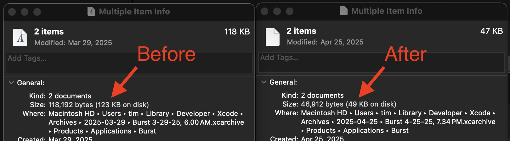

+++
date = '2025-04-30T05:00:00-07:00'
title = 'Save space by using compact fonts'
+++

*Disclaimer: I'm not a font expert. The strategy pitched in this post may have drawbacks I haven't yet discovered.*

Last week at work we were importing a new font to use in some countries that was rather large. The designer I was working with managed to slim it down a bit, but it still wound up being 14 MB. This got me thinking if there was a way to reduce the size further.

I asked my favorite coding companion AI, Claude, for advice. [Claude mentioned](https://claude.ai/share/43d27ecf-a8c7-4424-a7f5-9f9f099fad2c) trying out the newer font format `.woff2`, developed by Google for compactness. I initially dismissed this idea thinking that iOS only supports `.ttf` and `.otf`, but upon trying it I've found that `.woff2` does work on iOS!

It's trivial to convert existing fonts to `.woff2` with a tool you can get through homebrew.

```shell
# Install Google's woff2 tool
brew install woff2

# Convert a font to woff2
woff2_compress [your_font_here]
```

You'll then need to update and references to the old font name containing its former file extension, most commonly in the info.plist `UIAppFonts` field. Once you do this everything should work!

This wound up saving:
- **10.9 MB** on the new font we imported (14.1 MB → 3.2 MB, **78% reduction**)
- An additional **~800 KB** (1.2 MB → ~400 KB, **~65% reduction**) in the other fonts we use in [Retro](https://retro.app).

I also applied this strategy to [the font](https://github.com/RedHatOfficial/RedHatFont) I'm using in [Burst](https://apps.apple.com/app/id1355171732) saving 71KB, close to **10% of the app's overall size**.



I can't find definitive documentation of when iOS added support for `.woff2`, but it's been supported in Safari [since iOS 10](https://caniuse.com/?search=woff2). This seems like it could be a reasonable proxy for OS support, and I've tested it working as far back as iOS 15.8.4.

If you're looking for places to reduce your app's size and you're using custom fonts, leveraging `.woff2` could be a good way to get some savings!